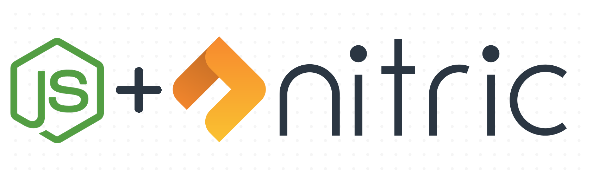

<p align="center">
  
</p>


# @nitric/sdk
The NodeJS SDK supports the use of the cloud-portable [Nitric](https://nitric.io) framework with NodeJS 12+.
> The SDK is in early stage development and APIs and interfaces are still subject to breaking changes

## Prerequisites
- NodeJS 12+

## Getting Started

### Using the [Nitric CLI](https://github.com/nitric-tech/cli)
> @nitric/sdk is included in all node related SDK projects by default

```bash
nitric make:function <node-template> example
```

Some available node templates are:

* faas/nodejs12
* faas/nodets12
* community/nextjs


### Adding to an existing project
**NPM**
```bash
npm install @nitric/sdk
```
**Yarn**
```bash
yarn add @nitric/api
```

## Usage
The nitric node SDK contains modules that cover (Usage examples and detailed API documentation included in the links):
* [FaaS](./docs/typedoc/modules/faas.md)
* [Events](./docs/typedoc/classes/eventclient.md)
* [Queues](./docs/typedoc/classes/eventclient.md)
* [Storage](./docs/typedoc/classes/storageclient.md)
* [KV Store](./docs/typedoc/classes/keyvalueclient.md)

Base gRPC clients are also made available from this package via the [grpc](./docs/typedoc/modules/grpc.md) module

## Local Development

```bash
yarn install
yarn build
```
